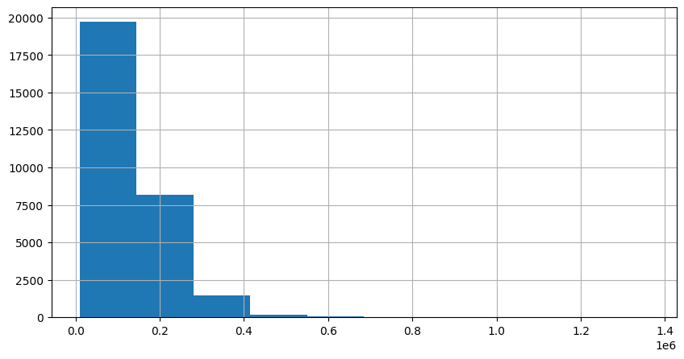
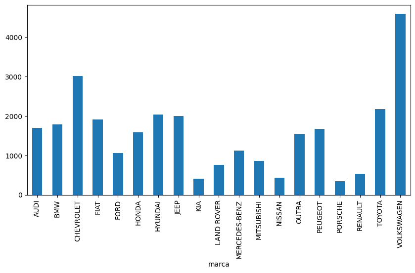
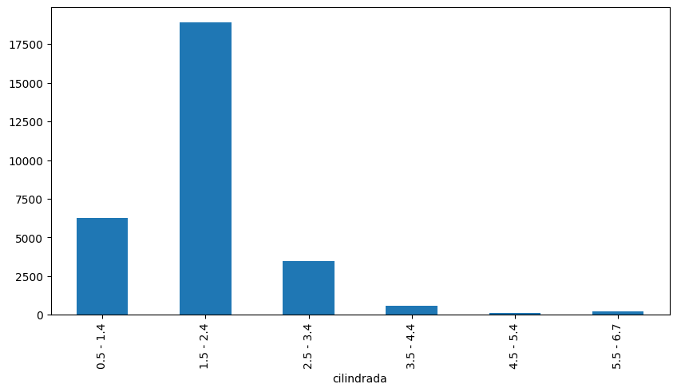
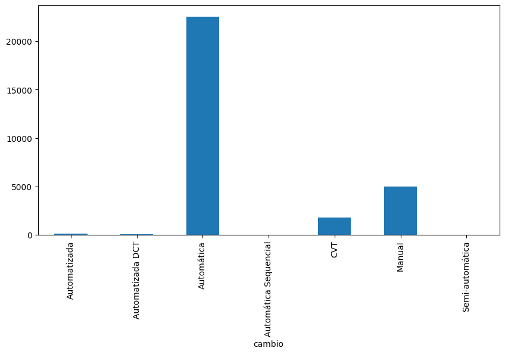
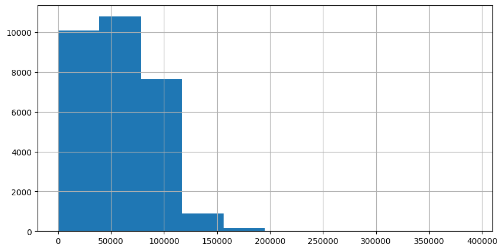
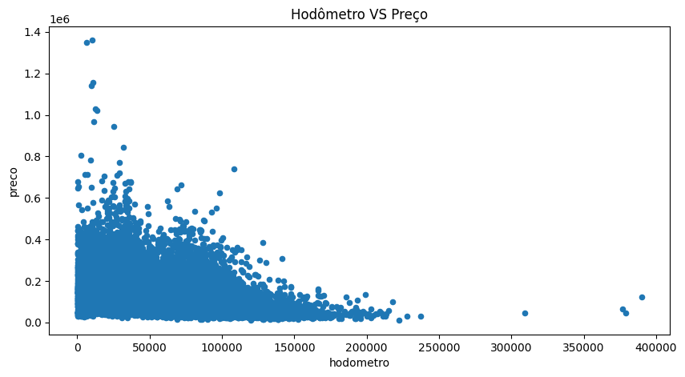
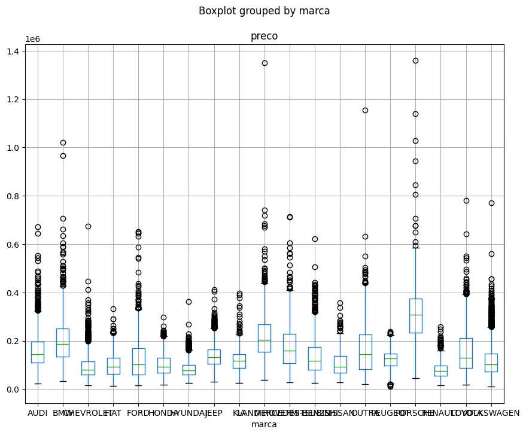
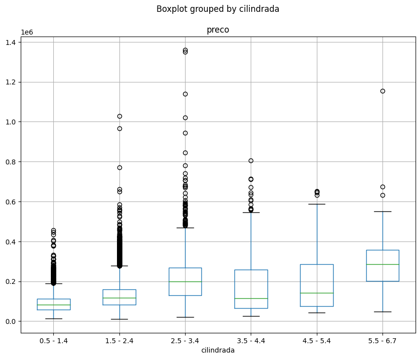

# Análise Estatística - Desafio Lighthouse Ciência de Dados
## Dados gerais:
O conjunto de dados possui **29584 linhas** e **19 colunas**, cujo tipo de valores são: booleanas, float64, int64 e object. O número de colunas para estes valores são respectivamente: 3, 5, 2 e 19.

A lista com o tipo de cada uma das variáveis é a seguinte:
- 'id': **categórica**
- 'num_fotos': **quantitativa discreta**
- 'marca': **categórica**
- 'modelo': **categórica**
- 'versao': **contém informações categóricas**
- 'ano_de_fabricacao': **quantitativa discreta**
- 'ano_modelo': **quantitativa discreta**
- 'hodometro': **quantitativa contínua**
- 'cambio': **categórica**
- 'num_portas': **quantitativa discreta**
- 'tipo': **categórica**
- 'blindado': **categórica**
- 'cor': **categórica**
- 'tipo_vendedor': **categórica**
- 'cidade_vendedor': **categórica**
- 'estado_vendedor': **categórica**
- 'anunciante': **categórica**
- 'entrega_delivery': **categórica**
- 'troca': **categórica**
- 'elegivel_revisao': **categórica**
- 'dono_aceita_troca': **categórica**
- 'veiculo_único_dono': **categórica**
- 'revisoes_concessionaria': **categórica**
- 'ipva_pago': **categórica**
- 'veiculo_licenciado': **categórica**
- 'garantia_de_fábrica': **categórica**
- 'revisoes_dentro_agenda': **categórica**
- 'veiculo_alienado': **categórica**
- 'preco': **quantitativa contínua, (TARGET)**

## Visualização da distribuição da variável target:
A distribuição da variável target não apresenta valores discrepantes. Ela é uma indicação positiva para a implementação de algoritmos de aprendizado de máquina.

## Visualização da distribuição de algumas features:

A distribuição da vairável 'marca' é bastante regular no conjunto de dados, o que constitui uma indicação positiva.

A distribuição da variável 'cilindrada', por outro lado, possui categorias cuja contagem é muito baixa. Em geral, isso indica que é um tipo de variável que pode não ser muito proveitosa. Nas análises que se seguirão, essa questão retornará.

O mesmo ocorre com a distribuição da variável 'cambio'.

Para a distribuição de variáveis quantitativas contínuas, utiliza-se geralmente o histograma. É o caso da variávem 'hodometro'. Assim como no caso do 'preco', observa-se regularidade no gráfico.

## Visualização de algumas relações entre entre features e target:

O gráfico de dispersão entre 'hodometro' e 'preco' indica que há uma relação entre as duas variáveis. Na medida em que 'hodometro' aumenta, o 'preco' diminui.

O gráfico de boxplot entre 'marca' e 'preco' também indica que há um relação entre as duas variáveis. Nesse caso, é possível perceber que cada 'marca' se encontra numa faixa de 'preco' diferente.

A mesma coisa ocorre com a relação entre 'preco' e 'cilindrada'.

